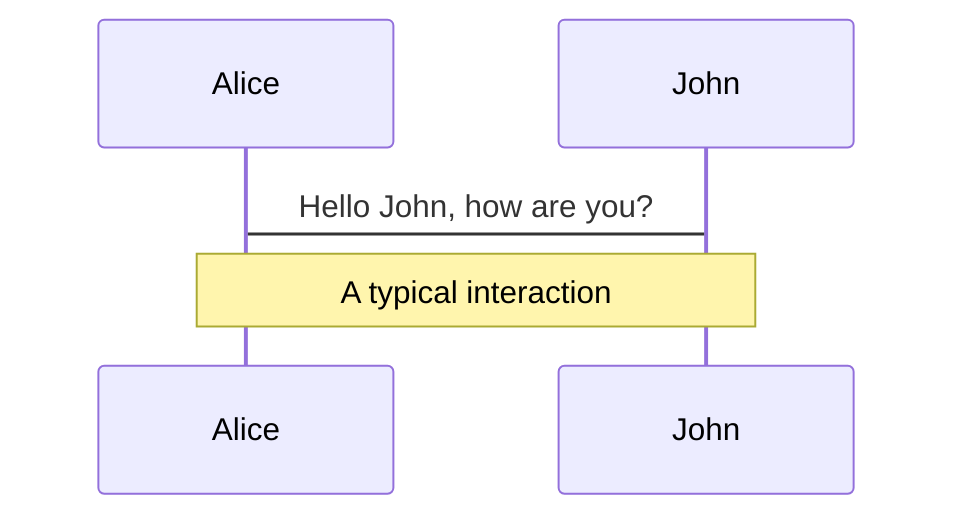
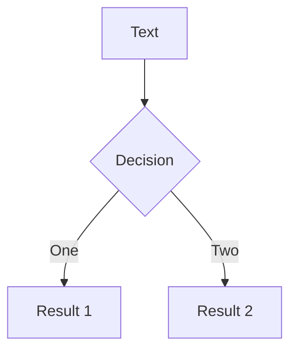

---
# try also 'default' to start simple
theme: seriph
# random image from a curated Unsplash collection by Anthony
# like them? see https://unsplash.com/collections/94734566/slidev
background: https://source.unsplash.com/collection/94734566/1920x1080
# apply any windi css classes to the current slide
class: 'text-center'
# https://sli.dev/custom/highlighters.html
highlighter: shiki
# some information about the slides, markdown enabled
info: |
  ## 微型web框架的实现原理简单分析

---

# 微型web框架的实现原理

Rack + DSL

oliver.chen
---

# 一个Web应用需要什么？

<v-clicks>

1. 能够响应 http 请求
2. 定义路由及响应内容
3. 尽可能少写点代码
4. ...

</v-clicks>


---

# Ruby世界中，有个Rack

app.rb 文件

```ruby
require 'rack'

app = proc do |env| 
  [200, {'Content-Type' => 'text/html'}, ['Hello, Rack demo']]
end

Rack::Server.start(app: app)
```

执行 `ruby app.rb`, 访问 http://0.0.0.0:9292/


---

# 什么是Rack？

1. 是一份规范。（【应用程序】与【应用服务器】之间的接口规范）

  https://github.com/rack/rack/blob/master/SPEC.rdoc


2. 是一个gem，封装了对HTTP数据的处理。

  比如：解析path, 解析params, 中间件的处理等等。
  https://github.com/rack/rack

---

# Rack返回结构

- 一个对象，可以相应 `call` 方法 （可以是 proc 或者 自定义对象）
- 接收一个 环境变量 `env` 作为参数
- 返回一个三个元素的数组
  1. HTTP 状态码   
  2. HTTP header   
  3. 一个响应 each 方法的对象，用来将内容处理为body

<br>

```ruby
app = proc do |env| 
  [200, {'Content-Type' => 'text/html'}, ['Hello, Rack demo']]
end
```

---

# 另一种形式

<div class="grid grid-cols-2 gap-x-4">
  <div>

miniweb.rb

```ruby
module Miniweb
 class Base

  def call(env)
    [200, {'Content-Type' => 'text/html'}, ['Hello, MiniApp demo']
  end

 end
end
```
  </div>

  <div>

app.rb
```ruby
require 'rack'
require_relative 'miniweb'

app = Miniweb::Base.new

Rack::Server.start(app: app)
```
  </div>
</div>

---

# 完成了第一步，响应HTTP请求，那下一步？

<v-clicks>

- 需要定义路由
- 路由对应的处理

</v-clicks>

---

# 来看看平时使用 Grape 定义路由的方式


```ruby
desc "字段详情页"
params do 
  requires :field_id, type: String, desc: "字段 ID"
end
get "/form_fields/show" do 
  form_field = RccForm::Metadata::FormField.where(id: params[:field_id]).first 
  raise NotFound if form_field.nil? 
  render_happy(data: form_field.show_json)
end
```

---

# 我们需要的结构

```ruby
get "/show" do
end

post "/create" do
end

put "/update" do
end

delete "/destory" do
end
```

---


# 定义路由收集的方法

```ruby
module Miniweb
  class Base
    attr_reader :routes

    def initialize
      @routes = {}
    end

    def get(path, &handler)
      route("GET", path, &handler)
    end

    def post(path, &handler)
      route("POST", path, &handler)
    end

    # verb: get/post/put/delete
    def route(verb, path, &handler)
      @routes[verb] ||= {}
      @routes[verb][path] = handler
    end
  end
end
```

---


# 进行路由收集

```ruby
require 'rack'
require_relative 'miniweb'

app = Miniweb::Base.new

app.get "/show" do
  p "show me ..."
  [200, {}, ["mini_app show ..."]]
end

app.post "/create" do
  p "create me ..."
  [200, {}, ["mini_app create ..."]]
end

p app.routes
# {
#   "GET"=>{"/show"=>#<Proc:0x00007fe01b162d00@mini_app.rb:31>},
#   "POST"=>{"/create"=>#<Proc:0x00007fe01b162be8@mini_app.rb:35>}
#}
```

---

# call 方法里面获取请求信息

此时，去访问 http://0.0.0.0:9292/show ，还是得到旧的结果。

那是因为我们还没在 `call` 进行路由的判断。

```ruby
module Miniweb
 class Base

  def call(env)
    [200, {'Content-Type' => 'text/html'}, ['Hello, MiniApp demo']
  end

 end
end
```

查看协议部分 -- https://github.com/rack/rack/blob/master/SPEC.rdoc

---

# 查看 env 的内容

```ruby
{"rack.version"=>[1, 3],
 "rack.errors"=>#<IO:<STDERR>>,
 "rack.multithread"=>true,
 "rack.multiprocess"=>false,
 "rack.run_once"=>false,
 "SCRIPT_NAME"=>"",
 "QUERY_STRING"=>"",
 "SERVER_PROTOCOL"=>"HTTP/1.1",
 "SERVER_SOFTWARE"=>"puma 3.12.6 Llamas in Pajamas",
 "GATEWAY_INTERFACE"=>"CGI/1.2",
 "REQUEST_METHOD"=>"GET",
 "REQUEST_PATH"=>"/show",
 "REQUEST_URI"=>"/show",
 "HTTP_VERSION"=>"HTTP/1.1",
 "HTTP_HOST"=>"0.0.0.0:9292",
 "HTTP_USER_AGENT"=>
  "Mozilla/5.0 (Macintosh; Intel Mac OS X 10_14_6) AppleWebKit/537.36 (KHTML, like Gecko) Chrome/91.0.4472.77 Safari/537.36",
 "HTTP_ACCEPT"=>
  "text/html,application/xhtml+xml,application/xml;q=0.9,image/avif,image/webp,image/apng,*/*;q=0.8,application/signed-exchange;v=b3;q=0.9",
 "HTTP_ACCEPT_ENCODING"=>"gzip, deflate",
 "HTTP_ACCEPT_LANGUAGE"=>"zh-CN,zh;q=0.9,en;q=0.8,no;q=0.7",
 "HTTP_PURPOSE"=>"prefetch",
 ...
```

---

# 借助 rack 里的工具

<div class="grid grid-cols-2 gap-x-4">
  <div>

初版

```ruby
def call(env)
  @request = Rack::Request.new(env)
  verb = @request.request_method
  requested_path = @request.path_info

  handler = @routes[verb][requested_path]

  handler.call
end
```
  Rack 中有许多类似 `Rack::Request` 的工具可以使用。
  </div>

  <div>

未找到匹配路由

```ruby {7-12}
def call(env)
  @request = Rack::Request.new(env)
  verb = @request.request_method
  requested_path = @request.path_info

  handler = @routes[verb][requested_path]

  if handler
    handler.call
  else
    [404, {}, ["url no found ..."]]
  end
end
```

  </div>
</div>


---

最基本的路由匹配已经有了。

不过目前对于那种动态路由，还不能正常处理。
而路由的匹配算法，就有很多种了... 

有兴趣的小伙伴也可以深挖下，把不同语言的不同框架中是如何处理~

正则匹配？状态机？基数树？...... 

---

# 让使用者更方便


现在来瞅瞅存在的问题。

```ruby
app = Miniweb::Base.new

app.get "/show" do
end

app.post "/create" do
end

Rack::Server.start(app: app)
```

更方便地使用？

---

miniweb.rb:
```ruby {5}
module Miniweb 
  class Base 
  end 

  Application = Base.new   # <-- 新增
end
```

app.rb
```ruby {1}
app = Miniweb::Application

app.get "/show" do
end

app.post "/create" do
end

Rack::Server.start(app: app)
```

如果 get 、post 能直接挂到Miniweb::Application上，就不用 app了?

---

miniweb.rb
```ruby
module Miniweb
  module Delegator
    def self.delegate(*methods, to:)
      Array(methods).each do |method_name|
        define_method(method_name) do |*args, &block|
          to.send(method_name, *args, &block)
        end

        private method_name
      end
    end

    delegate :get, :post, to: Application
  end
end

include Miniweb::Delegator

```

在引入 `miniweb.rb` 时，就会生成对应方法 `get / post`，
会直接调用 `Application.get / Application.post`。

---

# 于是，变成了

```ruby
require 'rack'
require_relative 'miniweb'

get "/show" do
  p "show me ..."
  [200, {}, ["mini_app show ..."]]
end

post "/create" do
  p "create me ..."
  [200, {}, ["mini_app create ..."]]
end

Rack::Server.start(app: Miniweb::Application)
```

只要引入 `miniweb`，然后就可以直接使用 `get / post` 去定义路由了。

---

大概就是这样... 这是 [miniweb gitlab](https://git.rccchina.com/oliver.chen/miniweb) 代码。
<br>
<br>
当然，这里主要讲的是思路，没有太多的细节，功能也很简单。


一些细节还得后面持续研究。比如那个 路由匹配算法....


---

# 资料

- [Rack应用及相关](https://www.yuque.com/chenxiaodong-hvqvm/zbb1us/ke7fps)
- [谈谈 Rack 的协议与实现](https://draveness.me/rack/)
- [lets-build-a-sinatra](https://thoughtbot.com/blog/lets-build-a-sinatra)

---

# Welcome to Slidev

Presentation slides for developers

<div class="pt-12">
  <span @click="$slidev.nav.next" class="px-2 p-1 rounded cursor-pointer" hover="bg-white bg-opacity-10">
    Press Space for next page <carbon:arrow-right class="inline"/>
  </span>
</div>

<a href="https://github.com/slidevjs/slidev" target="_blank" alt="GitHub"
  class="abs-br m-6 text-xl icon-btn opacity-50 !border-none !hover:text-white">
  <carbon-logo-github />
</a>

<!--
The last comment block of each slide will be treated as slide notes. It will be visible and editable in Presenter Mode along with the slide. [Read more in the docs](https://sli.dev/guide/syntax.html#notes)
-->

---

# What is Slidev?

Slidev is a slides maker and presenter designed for developers, consist of the following features

- 📝 **Text-based** - focus on the content with Markdown, and then style them later
- 🎨 **Themable** - theme can be shared and used with npm packages
- 🧑‍💻 **Developer Friendly** - code highlighting, live coding with autocompletion
- 🤹 **Interactive** - embedding Vue components to enhance your expressions
- 🎥 **Recording** - built-in recording and camera view
- 📤 **Portable** - export into PDF, PNGs, or even a hostable SPA
- 🛠 **Hackable** - anything possible on a webpage

<br>
<br>

Read more about [Why Slidev?](https://sli.dev/guide/why)

<!--
You can have `style` tag in markdown to override the style for the current page.
Learn more: https://sli.dev/guide/syntax#embedded-styles
-->

<style>
h1 {
  background-color: #2B90B6;
  background-image: linear-gradient(45deg, #4EC5D4 10%, #146b8c 20%);
  background-size: 100%;
  -webkit-background-clip: text;
  -moz-background-clip: text;
  -webkit-text-fill-color: transparent;
  -moz-text-fill-color: transparent;
}
</style>

---

# Navigation

Hover on the bottom-left corner to see the navigation's controls panel, [learn more](https://sli.dev/guide/navigation.html)

### Keyboard Shortcuts

|     |     |
| --- | --- |
| <kbd>right</kbd> / <kbd>space</kbd>| next animation or slide |
| <kbd>left</kbd> | previous animation or slide |
| <kbd>up</kbd> | previous slide |
| <kbd>down</kbd> | next slide |

<!-- https://sli.dev/guide/animations.html#click-animations -->

<p v-after class="absolute bottom-23 left-45 opacity-30 transform -rotate-10">Here!</p>

---
layout: image-right
image: https://source.unsplash.com/collection/94734566/1920x1080
---

# Code

Use code snippets and get the highlighting directly!

<!-- https://sli.dev/guide/syntax.html#line-highlighting -->

```ts {all|2|1-6|9|all}
interface User {
  id: number
  firstName: string
  lastName: string
  role: string
}

function updateUser(id: number, update: User) {
  const user = getUser(id)
  const newUser = {...user, ...update}
  saveUser(id, newUser)
}
```

<arrow v-click="3" x1="400" y1="420" x2="230" y2="330" color="#564" width="3" arrowSize="1" />

---

# Components

<div grid="~ cols-2 gap-4">
<div>

You can use Vue components directly inside your slides.

We have provided a few built-in components like `<Tweet/>` and `<Youtube/>` that you can use directly. And adding your custom components is also super easy.

```html
<Counter :count="10" />
```

<!-- ./components/Counter.vue -->
<Counter :count="10" m="t-4" />

Check out [the guides](https://sli.dev/builtin/components.html) for more.

</div>
<div>

```html
<Tweet id="1390115482657726468" />
```

<Tweet id="1390115482657726468" scale="0.65" />

</div>
</div>


---
class: px-20
---

# Themes

Slidev comes with powerful theming support. Themes can provide styles, layouts, components, or even configurations for tools. Switching between themes by just **one edit** in your frontmatter:

<div grid="~ cols-2 gap-2" m="-t-2">

```yaml
---
theme: default
---
```

```yaml
---
theme: seriph
---
```


</div>

Read more about [How to use a theme](https://sli.dev/themes/use.html) and
check out the [Awesome Themes Gallery](https://sli.dev/themes/gallery.html).

---
preload: false
---

# Animations

Animations are powered by [@vueuse/motion](https://motion.vueuse.org/).

```html
<div
  v-motion
  :initial="{ x: -80 }"
  :enter="{ x: 0 }">
  Slidev
</div>
```

<div class="w-60 relative mt-6">
  <div class="relative w-40 h-40">
    
    
    
  </div>

  <div
    class="text-5xl absolute top-14 left-40 text-[#2B90B6] -z-1"
    v-motion
    :initial="{ x: -80, opacity: 0}"
    :enter="{ x: 0, opacity: 1, transition: { delay: 2000, duration: 1000 } }">
    Slidev
  </div>
</div>

<!-- vue script setup scripts can be directly used in markdown, and will only affects current page -->
<script setup lang="ts">
const final = {
  x: 0,
  y: 0,
  rotate: 0,
  scale: 1,
  transition: {
    type: 'spring',
    damping: 10,
    stiffness: 20,
    mass: 2
  }
}
</script>

<div
  v-motion
  :initial="{ x:35, y: 40, opacity: 0}"
  :enter="{ y: 0, opacity: 1, transition: { delay: 3500 } }">

[Learn More](https://sli.dev/guide/animations.html#motion)

</div>

---

# LaTeX

LaTeX is supported out-of-box powered by [KaTeX](https://katex.org/).

<br>

Inline $\sqrt{3x-1}+(1+x)^2$

Block
$$
\begin{array}{c}

\nabla \times \vec{\mathbf{B}} -\, \frac1c\, \frac{\partial\vec{\mathbf{E}}}{\partial t} &
= \frac{4\pi}{c}\vec{\mathbf{j}}    \nabla \cdot \vec{\mathbf{E}} & = 4 \pi \rho \\

\nabla \times \vec{\mathbf{E}}\, +\, \frac1c\, \frac{\partial\vec{\mathbf{B}}}{\partial t} & = \vec{\mathbf{0}} \\

\nabla \cdot \vec{\mathbf{B}} & = 0

\end{array}
$$

<br>

[Learn more](https://sli.dev/guide/syntax#latex)

---

# Diagrams

You can create diagrams / graphs from textual descriptions, directly in your Markdown.

<div class="grid grid-cols-2 gap-4 pt-4 -mb-6">





</div>

[Learn More](https://sli.dev/guide/syntax.html#diagrams)


---
layout: center
class: text-center
---

# Learn More

[Documentations](https://sli.dev) / [GitHub Repo](https://github.com/slidevjs/slidev)
